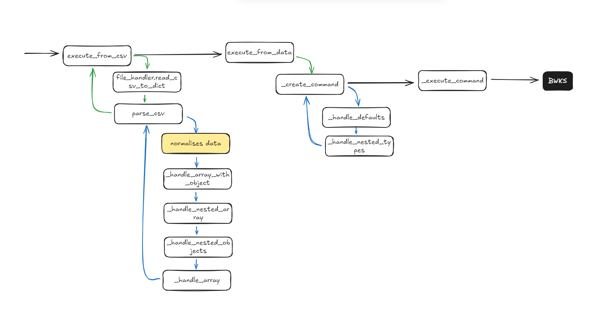

# Bulk operations overview

The bulk operations system lets you create and modify BroadWorks entities from CSV files or Python data structures.

## Architecture

The system has three layers:

- **BulkOperations** (gateway) - User-friendly methods for each entity type
- **Entity layer** - Individual operation classes like `UserBulkOperations` and `CallCenterBulkOperations`
- **BaseBulkOperations** (base) - Shared processing logic

## Data processing pipeline



Data flows through these stages:

1. **Input** - CSV file or Python data structure
2. **Parse** - Convert CSV rows or dicts to structured data
3. **Transform** - Apply type conversions, defaults, and nested object handling
4. **Command creation** - Build OCI command objects with nested types
5. **Execute** - Send commands to BroadWorks
6. **Results** - Return structured response data

## Key components

### BaseBulkOperations

Abstract base class with shared processing logic:

- CSV parsing with nested object and array handling
- Data type conversions (booleans, integers, phone numbers)
- Command creation with nested type instantiation
- Default value application
- Error handling and result formatting

### Entity operations

Each entity type has its own class inheriting from `BaseBulkOperations`:

- `UserBulkOperations`
- `CallCenterBulkOperations`
- `DeviceBulkOperations`
- `AutoAttendantBulkOperations`
- `HuntGroupBulkOperations`
- `CallPickupBulkOperations`

Each class defines an `operation_mapping` dictionary that configures:

- OCI command classes
- Nested type mappings
- Default values
- Integer field conversions

### BulkOperations gateway

The `BulkOperations` class provides a single interface:

```python
from mercury_ocip import Client, Agent

client = Client(...)
agent = Agent.get_instance(client)

# Access all bulk operations through agent.bulk
agent.bulk.create_user_from_csv("users.csv")
agent.bulk.create_call_center_from_data([...])
```

## Data formats

### CSV format

CSV files use dot notation for nested objects and bracket notation for arrays:

- Nested objects: `serviceInstanceProfile.name`
- Arrays: `alias[0]`, `alias[1]`
- Nested arrays: `accessDeviceEndpoint.contact[0]`
- Arrays with objects: `alternateUserId[0].alternateUserId`

### Python data format

Python dictionaries use snake_case keys and nested dictionaries:

```python
{
    "operation": "user.create",
    "service_provider_id": "SP",
    "service_instance_profile": {
        "name": "Call Center",
        "calling_line_id_first_name": "Center"
    },
    "alias": ["cc1", "cc2"]
}
```

## Operation mapping

Each entity operation class defines an `operation_mapping` that specifies:

```python
{
    "operation.name": {
        "command": "OCIClassName",  # OCI command class name
        "nested_types": {...},       # Nested type conversions
        "defaults": {...},           # Default values
        "integer_fields": [...]      # Fields to convert to int
    }
}
```

See [Adding a New Bulk Operation](./adding-bulk-operations.md) for details.

## Response format

All operations return a list of result dictionaries:

```python
[
    {
        "index": 0,
        "data": {...},           # Original input data
        "command": {...},         # Generated OCI command
        "response": {...},       # API response
        "success": True,          # Operation success status
        "error": None,           # Error message if failed
        "detail": None           # Additional error details
    }
]
```